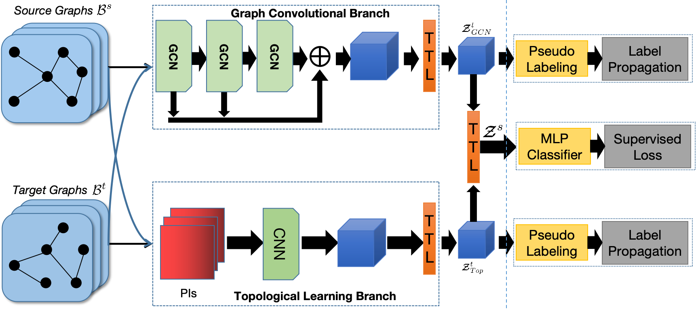

# Label Propagation GNN

This is the official implementation of the [paper]() "Bridging Domain Adaptation and Graph Neural Networks: A Tensor-Based Framework for Effective Label Propagation" published at [CPAL 2025](https://cpal.cc/) Proceedings Track.

## Abstract

Graph Neural Networks (GNNs) have recently become the predominant tools for studying graph data. Despite state-of-the-art performance on graph classification tasks, GNNs are overwhelmingly trained in a single domain under supervision, thus necessitating a prohibitively high demand for labels and resulting in poorly transferable representations. 
To address this challenge, we propose the Label-Propagation Tensor Graph Neural Network (LP-TGNN) framework to bridge the gap between graph data and traditional domain adaptation methods. It extracts graph topological information holistically with a tensor architecture and then reduces domain discrepancy through label propagation. It is readily compatible with general GNNs and domain adaptation techniques with minimal adjustment through pseudo-labeling. Experiments on various real-world benchmarks show that our LP-TGNN outperforms baselines by a notable margin.



## Prerequisite

This TGNN implementation is based on [TTG-NN](https://github.com/TaoWen0309/TTG-NN) and there are no extra prerequisites.

## Citation
Please consider citing our work if you find it useful:
```
@misc{wen2025bridgingdomainadaptationgraph,
      title={Bridging Domain Adaptation and Graph Neural Networks: A Tensor-Based Framework for Effective Label Propagation}, 
      author={Tao Wen and Elynn Chen and Yuzhou Chen and Qi Lei},
      year={2025},
      eprint={2502.08505},
      archivePrefix={arXiv},
      primaryClass={cs.LG},
      url={https://arxiv.org/abs/2502.08505}, 
}
```